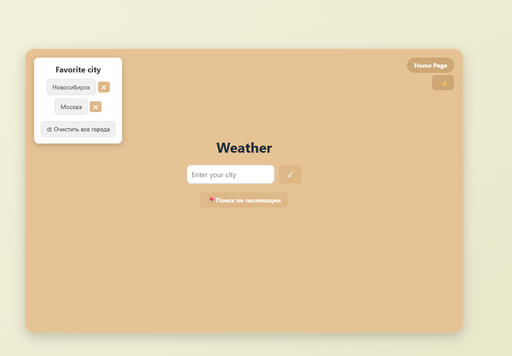

# Weather App 🌤️

Погода и прогноз на 5 дней по городу или геолокации.

🔗 **[Открыть сайт](https://weather-theta-lilac.vercel.app/weather/)**

---

## Скриншот работы приложения



## Возможности

- Поиск города
- Геолокация
- Прогноз на 5 дней
- Избранные города
- Фон под погоду

## Технологии

HTML, CSS, JavaScript, OpenWeatherMap API, LocalStorage

---

## 📁 Структура проекта
weather/
├── src/
│ └── modules/
│ ├── weather.js
│ ├── favorites.js
│ ├── theme.js
│ └── time.js
├── app.js
├── index.html
├── style.css
└── .env

text

---

## 🚀 Запуск локально

```bash
git clone https://github.com/gtxpit/weather.git
cd weather
npm install
npm run dev
Создай .env в корне:

text
VITE_WEATHER_KEY=твой_ключ
👨‍💻 Что изучил
Работа с DOM и событиями

Асинхронные запросы к API

LocalStorage

Геолокация

Адаптивная вёрстка

Деплой на Vercel и GitHub Pages

Разбивка кода на модули

🔗 Ссылки
Демо

GitHub

OpenWeatherMap API

MIT © gtxpit

text

---